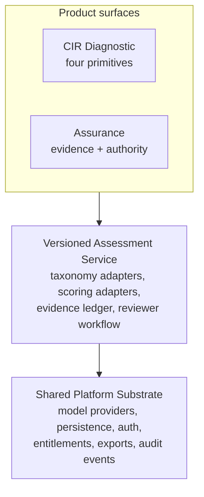
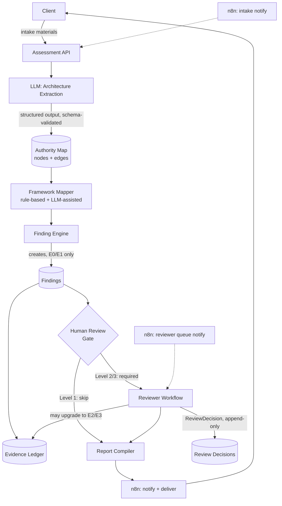

# Phase C: Technical Architecture

## Revision note

The original version of this document recommended a fully standalone service because CIR's internals were unverified at the time. A source-level audit (Manus, with real repository access) has since resolved that uncertainty and produced a more specific, better-reasoned answer than the standalone guess: not embedded in CIR's four primitives, and not a fully separate codebase either, but a separate product module on a shared platform substrate. That recommendation is adopted below, superseding the standalone-service framing.

Confirmed facts that drove the change: CIR (hillarynjuguna/CIR-Diagnostic-Engine, Next.js/React/TypeScript) implements four canonical primitives with real deterministic scoring, a five-provider model registry with fallback, and reusable intake/report UI, genuinely reusable. It does not have durable evidence/audit storage, authentication, payment gating, real PDF export, or cryptographic attestation, all placeholders or absent, so those must be built new for Assurance regardless of which architecture is chosen. The live homepage's seven-dimension and pricing copy does not match the current repository source, an unresolved deployment-provenance gap, noted but not blocking this decision.

## Stack decision

Separate product module on a shared platform substrate. Assurance owns its taxonomy, evidence ledger (Section D), authority graph, and report schema. CIR's model-provider client, fallback policy, and reusable intake/result UI components are consumed through an explicit adapter layer, not copied, and not the thing Assurance's own domain logic depends on directly.

- **Backend/API:** Node.js with TypeScript, a plain HTTP API (Express or Fastify, either is fine, no strong reason to pick one over the other at this scale).
- **Database:** PostgreSQL. No vector or graph database, the Authority Map is small enough per assessment to be a relational graph (see 03-domain-model.sql).
- **File/evidence storage:** any S3-compatible object store (Vercel Blob is a reasonable default given existing Vercel usage) for uploaded documents and evidence artifacts, with the content hash stored in Postgres, never the storage layer as the source of truth for integrity.
- **Workflow orchestration:** n8n, scoped narrowly, see the boundary below.
- **LLM orchestration:** direct API calls from application code (not from inside n8n) for anything that touches the evidence-integrity invariants, so the structured-output schema validation and the "LLM cannot self-validate" rule (05-ASSESSMENT-ENGINE.md) live in code that is actually tested, not in a workflow canvas.
- **Report generation:** application code renders the report from Finding/Evidence/Recommendation records, reusing CIR's existing report-export approach only once Section C's inspection actually happens, until then, a standalone renderer.

## Where n8n belongs and where it does not

**Belongs:** intake notifications, routing a flagged Finding to the Reviewer queue, sending the Reviewer a summary and a link, delivering the final report to the client, scheduling reminder nudges. Glue and notification, essentially.

**Does not belong:** evidence-level transitions, the "LLM cannot self-validate" enforcement, severity/confidence calculation, or anything that is a system invariant. Those must live in the application/database layer, where they can be unit tested and constrained at the schema level, not in a visual workflow where an invariant is one misconfigured node away from silently breaking.

## Product/platform relationship

CIR's existing provider registry and reusable UI live in the shared substrate and are consumed by Assurance through the adapter layer below, Assurance's own evidence ledger, authority graph, and scoring logic (Sections D and E) remain domain-owned, not derived from CIR's four-primitive taxonomy.

## Component diagram

## Trust boundaries

- Client-supplied intake material is untrusted input, it can only ever produce E0/E1 evidence, never higher, regardless of how confidently it's written.
- The LLM's structured output is untrusted with respect to evidence level, the schema itself caps what it's allowed to claim (06 schemas).
- Only an authenticated Reviewer or a test-harness execution can write an Evidence record at E2 or above (enforced in 03-domain-model.sql and at the API layer in 04-domain-model.ts).
