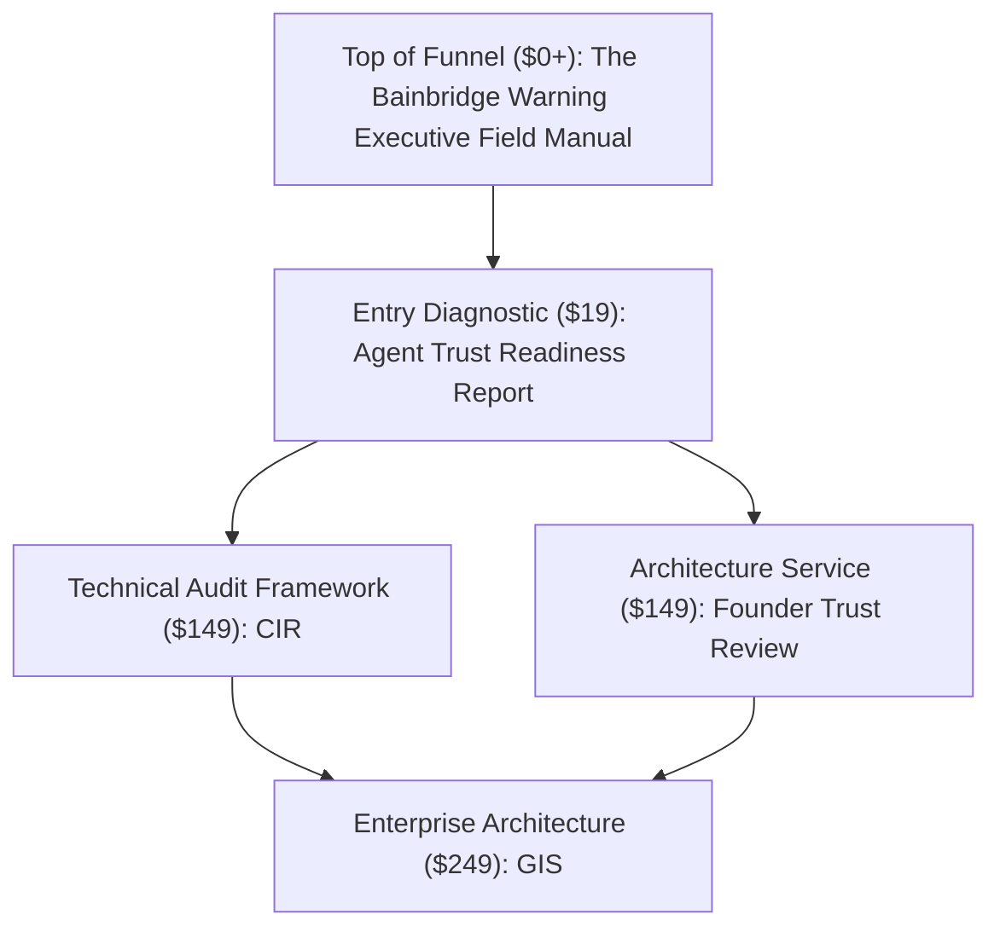

# Storefront Catalog Cleanup & Funnel Recommendation

**Date:** August 6, 2026  
**Storefront:** Hillary Njuguna (`hillarynjuguna.gumroad.com`)  

---

## Catalog Audit Matrix

The Gumroad account currently lists 6 active products:

| Product Title | Price | Permalink | Current Category / Role | Recommendation |
|:---|:---|:---|:---|:---|
| **The Bainbridge Warning: Executive Field Manual** | **$0+** | `BainbridgeWarning` | Lead magnet | **Keep Public**. Primary top-of-funnel conversion asset. |
| **Agent Trust Readiness Report** | **$19** | `agent-trust-readiness-report` | Entry paid diagnostic | **Keep Public**. Primary entry product for diagnostic users. |
| **Founder Trust Review** | **$149** | `founder-trust-review` | High-touch service review | **Keep Public**. Primary upsell for high-risk founders and $19 buyers. |
| **Infrastructure Readiness: Sovereign Audit Instrument** | **$149+** | `CIR` | Technical operational framework | **Keep Public**. Strong fit for CISOs, engineering leads, and platform operators. |
| **Governed Intelligence Specification (GIS)** | **$249** | `GIS` | Flagship architecture spec | **Keep Public**. Enterprise architecture and contract artifact. |
| **The Bainbridge Warning: Complete Doctrine** | **$149** | `TBW` | Theoretical doctrine text | **Recommend Hide / Deprecate**. Creates pricing and title confusion with the free Bainbridge lead magnet and the $149 CIR offer. |

---

## Recommended Funnel Architecture

## Recommendation Requiring Approval

Hide or unpublish `TBW` before broader traffic.

Reason: it is the only listing that muddies the buyer path. A visitor may see two Bainbridge products, one free and one $149, and wonder whether the free product is incomplete, whether the paid product replaces CIR, or whether the storefront has duplicate old inventory. That confusion is expensive at this stage because the trust-readiness funnel needs to feel crisp.

No products should be unpublished without explicit owner approval.

## Suggested Storefront Grouping

1. **Free lead magnet:** `BainbridgeWarning`
2. **Self-service diagnostic:** `agent-trust-readiness-report`
3. **Operational frameworks:** `CIR`, `GIS`
4. **Service offer:** `founder-trust-review`
